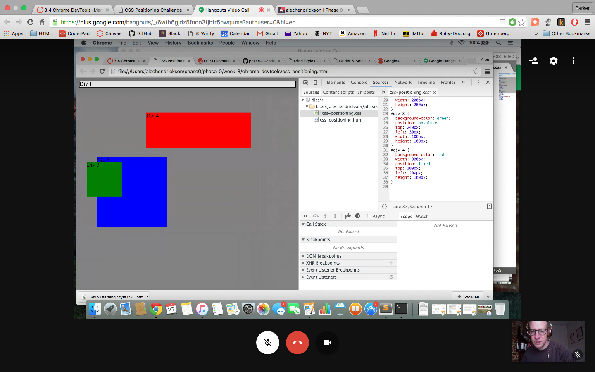
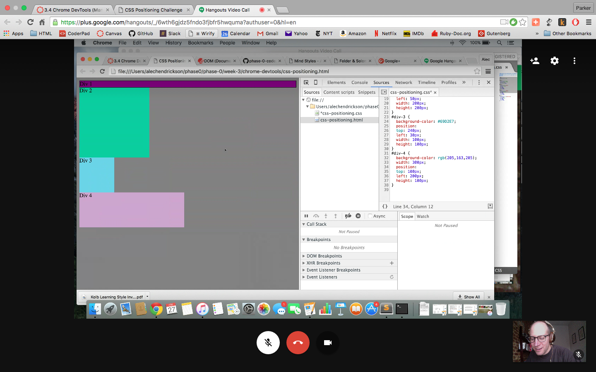
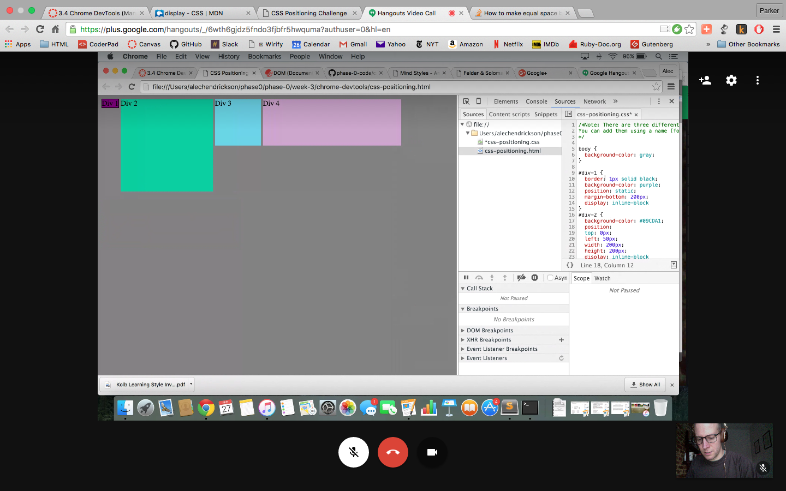
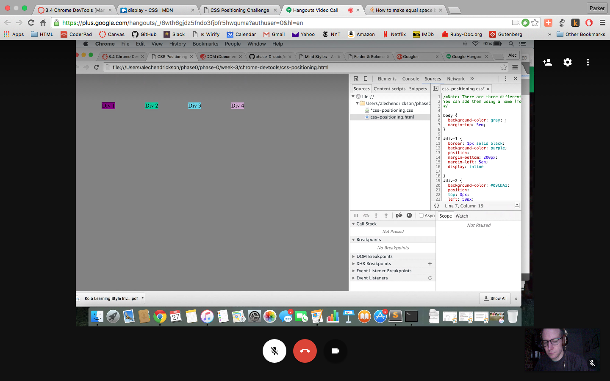
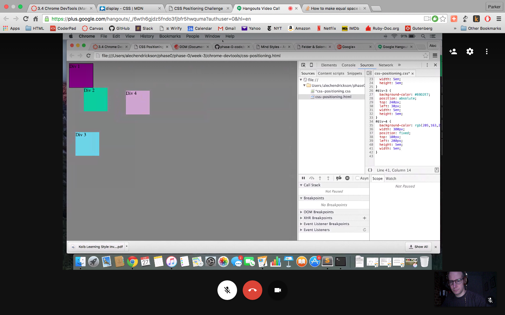
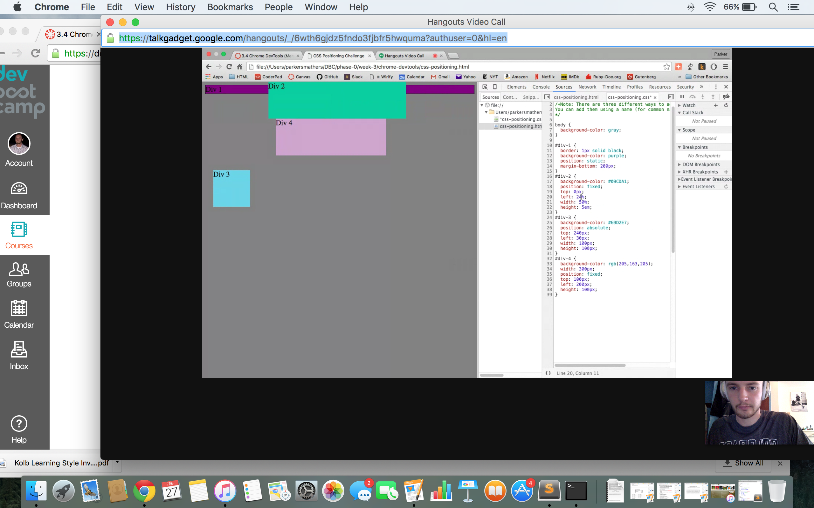
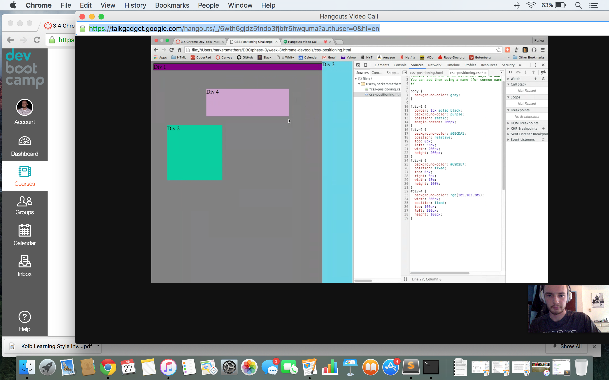
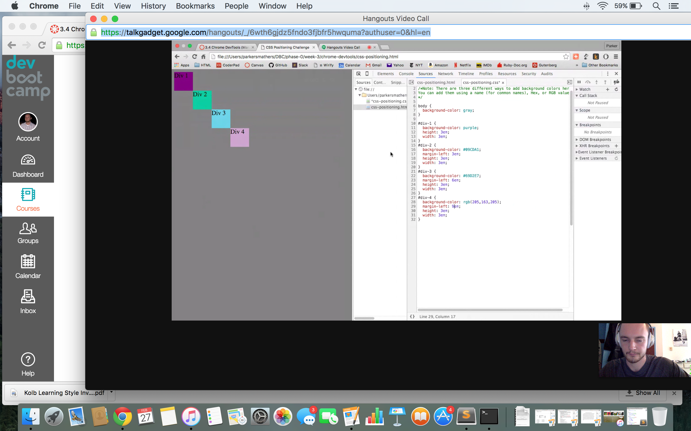

##How can you use Chrome's DevTools inspector to help you format or position elements?

Chrome DevTools inspector allows you to make changes to the CSS and see the changes in real time. You can experiment directly with the formatting rather than toggling back and forth between the editor and browser.

##How can you resize elements on the DOM using CSS?

You can change the width, height, and other elements.

##What are the differences between absolute, fixed, static, and relative positioning? Which did you find easiest to use? Which was most difficult?

<em>absolute</em>: positions an element exactly in one place; used with top, right, bottom, left. It is relative to the next parent element, either relative or absolute, and if there is no other parent element then it is relative to the html element.
<em>fixed</em>: element position is fixed relative to the viewpoint; if you scroll down the fixed element remains in the screen.
<em>static</em>: default value for page elements
<em>relative</em>: sets an element relative to itself. You need to use top, right, bottom, right, else the position doesn't change. You can set absolute children within relative parents. Relative was the most difficult to understand. Static was the easiest.

##What are the differences between margin, border, and padding?

Margin is the space around an element. Border is the frame. Padding is like matting in picture framing, where the element is the picture and the mat is the negative space surrounding the picture.

##What was your impression of this challenge overall? (love, hate, and why?)

This was my favorite challenge thus far. I learned a lot about DevTools and also it helped clarify positioning for me.
