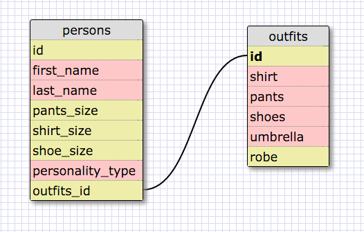

What are databases for?
Storing data

What is a one-to-many relationship?
When a record in one table is linked to a number of records in another table

What is a primary key? What is a foreign key? How can you determine which is which?
A primary key is a unique table column for identifying all table records
A foreign key in a second table refers to a primary key in an initial table
"id" signifies a primary key in table1, "table1.id" signifies it's a the foreign key

How can you select information out of a SQL database? What are some general guidelines for that? 
SELECT * FROM table_name... selects all records in a table
SELECT * field_name FROM table_name... selects table data contained in a specific column