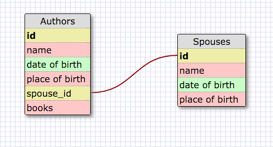
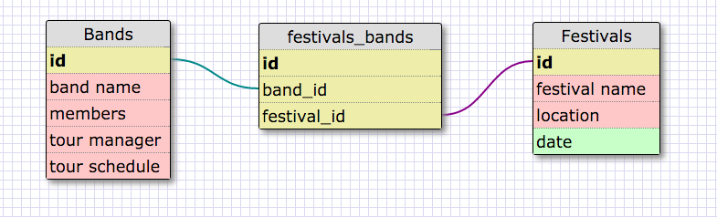
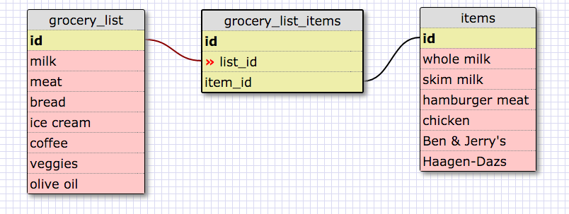

What is a one-to-one database?
When two databases have a single relationship with one another

When would you use a one-to-one database? (Think generally, not in terms of the example you created).
When a group of fields can optionally be empty

What is a many-to-many database?
Two distinct databases connected by a join table

When would you use a many-to-many database? (Think generally, not in terms of the example you created).
When tables could otherwise function independantly from each other

What is confusing about database schemas? What makes sense?
When to use 1to1 vs 1tomany. The grocery list and grocery items makes sense to me. You need an intermediary to join many similar things together across lists.